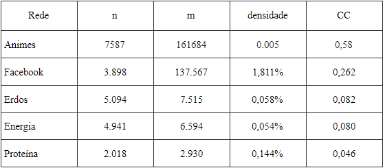
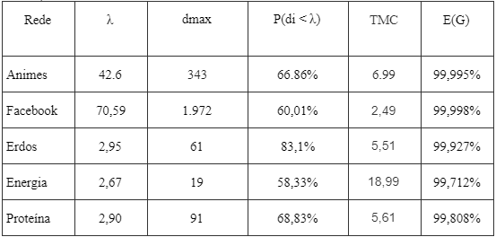
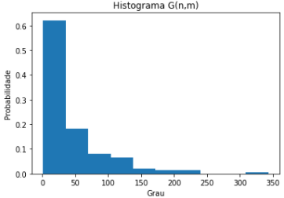

# Rede-Complexa-Animes
Breve estudo sobre as características das redes complexas, modelando a partir de um banco de dados.

UNIVERSIDADE FEDERAL RURAL DE PERNAMBUCO 
DEPARTAMENTO DE ESTATÍSTICA E INFORMÁTICA 
BACHARELADO EM SISTEMAS DE INFORMAÇÃO - 2020.1 
MODELOS EM REDES - GE3 

feito por:  Rodrigo Nativo do Brasil Brochardt

Tema:  Estudo das características de redes complexas presentes na relação entre animações japonesas com base na similaridade dos gêneros

## Contexto
As animações japonesas são parte da cultura oriental a muitas décadas e com a globalização vem tomando mais território principalmente com o público ocidental, segundo a Associação Japonesa de Animações, em 2018 a área apresentou um investimento de mais de 81,12 bilhões de reais, sendo a indústria internacional responsável por 46 bilhões desse valor, com um crescimento advindo desde 2013 (fonte).
Sabendo disso, o intuito deste estudo é analisar, comparar os dados com redes já estudadas anteriormente e encontrar, se possível, propriedades que definem a preferência geral que tornam uma animação popular, baseado nas relações de similaridade dos gêneros de cada obra, utilizando métricas de redes complexas e o banco de dados disponível pelo MyAnimeList ([fonte](https://www.crunchyroll.com/pt-br/anime-news/2020/11/22/indstria-do-anime-cresceu-mais-15-em-2019-e-dobrou-seu-faturamento-em-dez-anos)).

## Objeto de estudo
O banco de dados que será utilizado para modelar o grafo foi obtido do MyAnimeList e disponibilizado pelo Kaggle ([link](https://www.kaggle.com/marlesson/myanimelist-dataset-animes-profiles-reviews)).

## Métodos
Para a modelagem da rede, foi necessário a limpeza dos dados utilizados, eliminação de duplicidades e remoção dos atributos dispensáveis, permanecendo apenas o ID dos animes e os gêneros que a obra possui.

Em seguida, o data frame preparado passou para a etapa de criação de conexões, o objetivo era criar os enlaces entre os animes com base na semelhança de gêneros, então o algoritmo itera entre cada uma das animações do banco de dados, obtendo sua lista de gêneros, faz uma comparação com os demais animes e cria uma pontuação de similaridade, caso essa pontuação seja maior que 70% o algoritmo armazena o ID dos animes comparados em um dicionário que possui o índice ID e TARGET, representando a conexão no grafo.

Após finalizado a etapa de conexão e criação do dicionário, foi utilizado o método ‘from_pandas_edgelist’  da biblioteca de Python NetworkX para gerar um grafo a partir do data frame feito na etapa anterior e utilizar para estudo a maior componente conectada do sistema, permitindo aplicar os métodos de análise disponíveis pelo NetworkX. As propriedades extraídas para o estudo foram o número de nós, número de enlaces, o grau médio, o tamanho médio dos caminhos, o diâmetro do grafo, o coeficiente de aglomeração, a densidade do grafo, hub do grafo, eficiência dos enlaces e o histograma.

## Resultados
Para fins de comparação, os resultados mostrados a seguir serão, não apenas os valores extraídos do grafo em estudo, mas também de estudos já feitos anteriormente com os grafos do [Facebook, Energia, Proteína e Erdos](https://redesemexame.blogspot.com/2020/09/observando-redes-complexas.html).

n (número de nós do grafo), m (número de enlaces), CC (coeficiente de aglomeração).  

λ (grau médio do grafo), dmax (maior grau do grafo), P(di < λ) (porcentagem dos nós com grau menor que o grau médio) ,TMC (tamanho médio dos caminhos) e E(G) (Eficiência dos enlaces). 

Com a obtenção do nós com maior grau, foi possível obter a partir do banco de dados o ID do anime em que os gêneros possuem uma das maiores conexões da rede e, com isso, foi descoberto que os gêneros mais conectados dentro da componente conectada são: ['Adventure', 'Comedy', 'Kids', 'Fantasy'].

Distribuição do grau da rede:  

## Conclusão

Como observado no estudo e utilizando as demais redes como comparação, pode-se observar que a rede Animes possui algumas características que definem as redes complexas, como seu [TMC](https://redesemexame.blogspot.com/2020/09/caminhos-na-rede.html) bastante abaixo em proporção a quantidade de nós e enlaces, na tabela é possível perceber, mesmo o número de nós ultrapassando os 7.000, o TMC  é de apenas 6.99 ,consequência da sua ótima taxa de [eficiência dos enlaces](https://redesemexame.blogspot.com/2020/09/eficiencia-dos-enlaces.html), com valor aproximado de 99,995% e que fica atrás apenas da rede Facebook. Outra observação interessante é a sua alta taxa de [coeficiente de aglomeração](https://redesemexame.blogspot.com/2020/09/coeficiente-de-aglomeracao.html), chegando na casa dos 0,5 e que permite entender que os elementos desta rede são [fortemente conectados](https://redesemexame.blogspot.com/2020/09/redes-e-grupos-de-nos.html) entre si, e mesmo sabendo que a rede Animes possui uma quantidade muito grande de enlaces, sua [densidade](https://redesemexame.blogspot.com/2020/09/densidade.html) mostra que a rede possui uma quantidade muito mais baixa do que deveria, o que a define como uma [rede esparsa](https://redesemexame.blogspot.com/2020/09/observando-redes-complexas.html) (este valor é influenciado pela porcentagem de similaridade exigida no momento da criação do grafo, para este estudo foi de 70%). Outro ponto importante é relacionado ao histograma gerado, onde evidencia uma propriedade pertencente às redes complexas, que é a de muitos nós com grau baixo, em comparação a rede Facebook, o [grau médio](https://redesemexame.blogspot.com/2020/09/grau-de-um-no.html) e o [grau do Hub](https://redesemexame.blogspot.com/2020/09/grau-de-um-no.html) da rede Animes não possuem uma disparidade tão grande se comparados, consequência da persistência de alguns gêneros na maioria das obras de animações e que poderia ser resolvida com o aumento da similaridade(questão para um próximo estudo mais aprofundado), porém, a rede não deixa evidente que satisfaz a [lei de potência](https://redesemexame.blogspot.com/2020/09/distribuicao-do-grau-em-redes-reais.html), mesmo possuindo mais de 66% de todos os nós abaixo do grau médio, a disparidade entre o maior grau e os demais não é muito alta, e isso fica visível comparando com as demais redes, com exceção da rede Energia, logo, a nova rede consegue sim apresentar grande parte das características de uma rede complexa.

Com os gêneros de um dos nós com maior conectividade existente na rede em mãos, é correto afirmar que ['Adventure', 'Comedy', 'Kids', 'Fantasy'] são os gêneros de maior preferência da maior parcela do público que consome as animações japonesas, sendo elas as responsáveis pela maior parte das produções feitas até hoje e contidas no banco de dados estudado.

